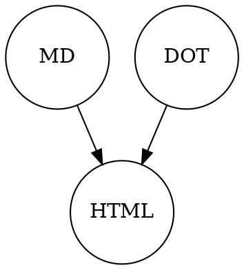

# Documentary

This is a **static website compilator** that works like this



This is self-documentated and `readme.md` contains all the examples you need.

## Installation

Install the requirements:

```bash
sudo apt-get install build-essential pandoc graphviz make pip
pip install pandocfilters
```

Clone this project from here and remove `.git` folder:

```bash
git clone git@github.com:/nirname/documentary.git && cd documentary && rm -rf .git
```

... or [download it](https://github.com/nirname/documentary/archive/master.zip).

## Usage

Put some `.md` files inside and compile them

```bash
make        # to build site
make serve  # to start serving files at localhost:8000
make watch  # to watch and recompile changes automatically
```

## Features

### Markdown

Markdown support comes from Pandoc

### Code highlighting

It does code highlighting by using Common package of [highlightjs](https://highlightjs.org/download/)

### Graphviz

Put in your project `graph.md` and write a link

```markdown

[Graph](graph.md)

```

`graph.md` will be converted to `graph.svg` and link will be automatically changed as well.

It is also possible to write embedded DOT graph like this

    ```graphviz
    digraph workflow {

      node [shape="circle" width=1 fixedsize=true]

      { MD, DOT } -> HTML

    }
    ```

This is the very code that produces graph at the top of the page

## Acknowledgements

The very idea of implementation is borrowed from [here](https://tylercipriani.com/blog/2014/05/13/replace-jekyll-with-pandoc-makefile/)

The idea of using inline `dot` graphs shamelessly taken from [here](https://gitlab.com/meonkeys/pandoc-dot-svg-hack/tree/master)
