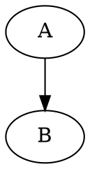

# Documentary

Static website compiler with markdown, charts and graphs support.

Converts simple text notation into pretty looking pages.

It doesn't pretend to be a new tool, it is just convenient union of other great tools.

Right now it includes:

* Markdown extended from *[Pandoc](https://pandoc.org/)*
* All the types of graphs that *[Graphviz](https://graphviz.org/)* supports
* Flowchart diagramms via *[Seqdiag](http://blockdiag.com/en/seqdiag/index.html)*
* Embedded and standalone images

## Getting Started

1. **Install Docker**

2. **Create new project or add existing folder**

    ```bash
    docker run --rm -it -v $(pwd):/local nirname/documentary init project
    ```
    then `cd project`.

    Or `cd project` first, then:

    ```bash

    docker run --rm -it -v $(pwd):/local nirname/documentary init .
    ```

    You can also configure source (src) and destination (docs) folder names, as well as your domain (CNAME).

    Full command example:

    ```bash
    docker run --rm -it -v $(pwd):/local nirname/documentary init project src docs my.website
    ```

    Your configuration will be saved in `nenv`.

3. **Build your project**

    Put some markdown in your source folder and:

    ```bash
    ./ndoc build
    ```

<!-- Open `docs/sample.html` -->

As simple as that.

## How to use it

To create an embedded graph add class to a code block:

````markdown
# Sample


````

Regarding standalone images a file with proper extension like `sample.dot` will be converted to `sample.dot.svg`.

Create a graph file:
```bash
echo "digraph { A->B }" > src/sample.dot
```

and add it to your markdown
```

```

Supported classes (they are extensions also) are:

* **dot**     - Graphviz 'dot'
* **neato**   - Graphviz 'neato'
* **fdp**     - Graphviz 'fdp'
* **sfdp**    - Graphviz 'sfdp'
* **twopi**   - Graphviz 'twopi'
* **circo**   - Graphviz 'circo'
* **seqdiag** - Blockdiag 'seqdiag'

## Styles

Currently, all the `css` are automatically included. Put some `*.css` files under source folder, then build.

For instance, you can download [Github markdown styles](https://github.com/sindresorhus/github-markdown-css/blob/gh-pages/github-markdown.css).

Code syntax highlight comes from Pandoc.

<!-- ## Documentation

Have a look at [documentation](https://nirname.github.io/documentary-docs/)
to find out what it is capable of. -->

<!-- You may try other [examples](https://nirname.github.io/documentary-docs/#examples) or
[build reveal.js presentation](https://nirname.github.io/documentary-docs/#reveal.js) as well. -->

## Structure of the project

* bin - executables
* plugins - things that enhance and extend markdown
* templates - self-descripting, this will be used as scaffold and put within project
* docs - documentation

## Join the Development

I would really appreciate any assistance so as to increase amount of diagrams and simplify usage.

* [Skim through the plan](docs/todo.md).
* [Have a look at what has been done so far in changelog](docs/changelog.md).
* [Grap sample markdown](docs/sample.md) to test if it works.

## Acknowledgements

The very idea of implementation is borrowed from [here](https://tylercipriani.com/blog/2014/05/13/replace-jekyll-with-pandoc-makefile/)

The idea of using inline `dot` graphs shamelessly taken from [here](https://gitlab.com/meonkeys/pandoc-dot-svg-hack/tree/master)
