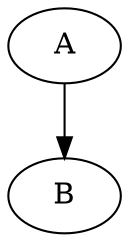

<style>
  svg {
    width: 400px;
  }
</style>

# Hello, my friend!

## Graph



## Sequence graph

```seqdiag
seqdiag {
  browser -> webserver [label = "GET /index.html"];
  browser <-- webserver;
}
```