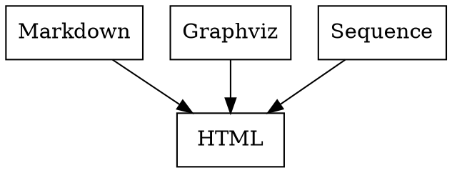

# Documentary

This is a static website generator on top of Pandoc and Make
with built-in Markdown, Gravhiz and Sequence diagrams support.

## Installation

Clone this project and remove `.git` folder:

```bash
git clone git@github.com:/nirname/documentary.git && cd documentary && rm -rf .git
```

... or [download it](https://github.com/nirname/documentary/archive/master.zip).

Install the requirements as follows.

Ubuntu:

```shell
sudo apt-get install build-essential pandoc graphviz pip
pip install pandocfilters seqdiag
```

MacOS:

```shell
brew install build-essential pandoc graphviz pip
pip install pandocfilters seqdiag
```

## Usage

1. **Create and Compile**

    Put some `*.md` files under `source/` folder and run `make` from this project's folder.

    Everything compiled will be found under `docs/` folder.

1. **Serve files**

    Run webserver via `make serve` and open `localhost:8000` in your browser.

1. **Watch changes**

    Run `make watch` in antoher tab to update compiled files automatically

Available commands are:

```bash
make clean  # to remove all the compiled pages, equal to rm -rf docs/*
make        # to build site
make serve  # to start serving files at localhost:8000
make watch  # to watch and recompile changes automatically
```

## Inline images

To create embedded graph add specific class to a code block.

---

**Graphviz**

````

````


---

**Sequence diagrams**

````
```seqdiag
seqdiag {
  make; pandoc; tool;
  make -> pandoc         [label = "markdown"];
          pandoc -> tool [label = "graph"];
          pandoc <- tool [label = "svg"];
  make <- pandoc         [label = "html"];
  make ->           tool [label = "graph"];
  make <-           tool [label = "svg"];
}
```
````

```seqdiag
seqdiag {
  make; pandoc; tool;
  make -> pandoc         [label = "markdown"];
          pandoc -> tool [label = "graph"];
          pandoc <- tool [label = "svg"];
  make <- pandoc         [label = "html"];
  make ->           tool [label = "graph"];
  make <-           tool [label = "svg"];
}
```

---

## Standalone images

It might be convenient to keep your graph as a separate file in case it is too big for inline usage.

To add external graph, put in your project `layouts.neato` with some valid graph inside and write a link to it:

```markdown


```


Layout of the image will be derived automatically by source file extension.
`formats.neato` will be converted to `formats.svg` and links to it will be automatically changed as well.

So as to change layout of the graph change source file extension, e.g. `formats.circo`.
Don't forget to change link to the graph to ``.

## Styles

[Github Markdown styles](https://github.com/sindresorhus/github-markdown-css) are built in.

## Syntax highlight

`kate` color scheme of Pandoc is beeing used as a default.

## Acknowledgements

The very idea of implementation is borrowed from [here](https://tylercipriani.com/blog/2014/05/13/replace-jekyll-with-pandoc-makefile/)

The idea of using inline `dot` graphs shamelessly taken from [here](https://gitlab.com/meonkeys/pandoc-dot-svg-hack/tree/master)
