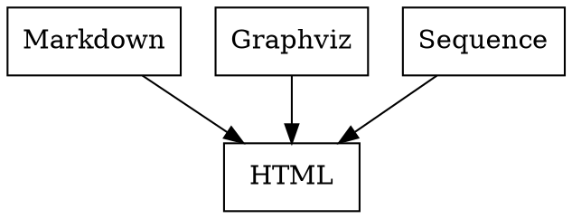

This is a static website generator on top of Pandoc and Make
with built-in Markdown, Gravhiz and Sequence diagrams support.

## Content

* [Installation](#installation)
* [Structure](#structure)
* [Usage](#usage)
* [Examples](#examples)

Read through [future development plans](todo.md).

## Installation

Clone this project and remove `.git` folder:

```bash
git clone git@github.com:/nirname/documentary.git && cd documentary && rm -rf .git
```

... or [download it](https://github.com/nirname/documentary/archive/master.zip).

Install the requirements as follows.

Pip:

```shell
https://pip.readthedocs.io/en/stable/installing/
```

Ubuntu:


```shell
apt-get install build-essential pandoc graphviz
pip install pandocfilters seqdiag
```

MacOS:

```shell
brew install build-essential pandoc graphviz
pip install pandocfilters seqdiag
```

Use `sudo` if needed.

## Structure

Projects consist of 4 folders:

* `source` - where you should put all the source, images and so on
* `docs` - where you will find your website
* `resoucres` - some ready styles for you (e.g. [Github Markdown styles](https://github.com/sindresorhus/github-markdown-css)), copy them to source folder if needed
* `plugins` - contains pandoc filers and other nicities

In fact the `source` and `docs` folders are all you need.

Syntax highlight comes from `kate` color scheme of Pandoc.

## Usage

1. **Create and Compile**

    Put some `*.md`, `*.css` and `*.dot` files under `source/` folder.

    Run `make` from this project's main folder.

    Everything compiled will be found under `docs/` folder.

1. **Serve files**

    Run webserver via `make serve` and open `localhost:8000` in your browser.

1. **Watch changes**

    Run `make watch` in antoher terminal to update compiled files automatically

Available commands are:

```bash
make clean  # to remove all the compiled pages, equal to rm -rf docs/*
make        # to build site
make serve  # to start serving files at localhost:8000
make watch  # to watch and recompile changes automatically
```

## Examples

### Inline images

To create embedded graph add specific class to a code block.

---

**Graphviz**

````

````


---

**Sequence diagrams**

````
```seqdiag
seqdiag {
  make; pandoc; tool;
  make -> pandoc         [label = "markdown"];
          pandoc -> tool [label = "graph"];
          pandoc <- tool [label = "svg"];
  make <- pandoc         [label = "html"];
  make ->           tool [label = "graph"];
  make <-           tool [label = "svg"];
}
```
````

```seqdiag
seqdiag {
  make; pandoc; tool;
  make -> pandoc         [label = "markdown"];
          pandoc -> tool [label = "graph"];
          pandoc <- tool [label = "svg"];
  make <- pandoc         [label = "html"];
  make ->           tool [label = "graph"];
  make <-           tool [label = "svg"];
}
```

---

### Standalone images

It might be convenient to keep your graph as a separate file in case it is too big for inline usage.

To add external graph, put in your project `layouts.neato` with some valid graph inside and write a link to it:

```markdown


```


Layout of the image will be derived automatically by source file extension.
`formats.neato` will be converted to `formats.svg` and links to it will be automatically changed as well.

So as to change layout of the graph change source file extension, e.g. `formats.circo`.
Don't forget to change link to the graph to ``.